Lecture 5 work
================
Nada Boutros
January 24,2019

``` r
# Class 05 R graphics intro

# My first boxplot
x <- rnorm(1000,0)
boxplot(x)
```

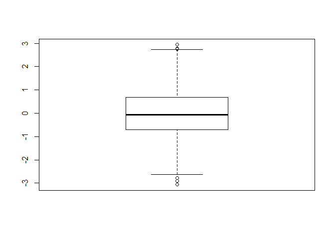

``` r
summary(x)
```

    ##     Min.  1st Qu.   Median     Mean  3rd Qu.     Max. 
    ## -3.06221 -0.69641 -0.06921 -0.03796  0.67882  2.93767

``` r
hist(x)
```

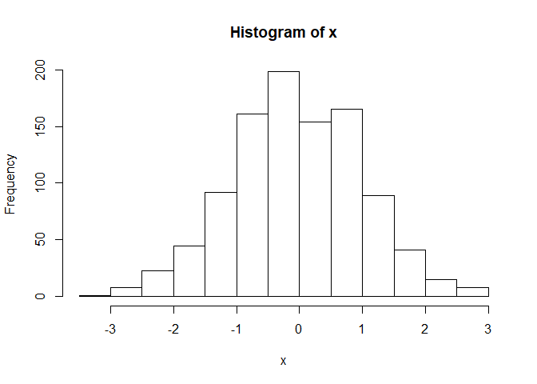

``` r
boxplot(x, horizontal = TRUE)
```

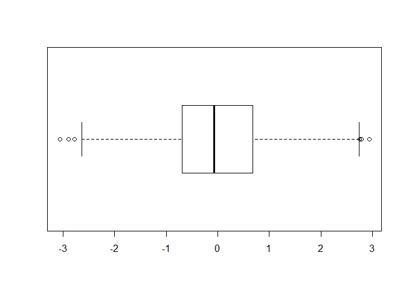

``` r
# Hands on session 2
weight <- read.table("bimm143_05_rstats/weight_chart.txt",header = TRUE)
plot(weight,pch=15,cex=1.5,lwd=2,ylim=c(2,10),xlab="Age(months)",ylab="Weight(kg)",main="Some title")
```

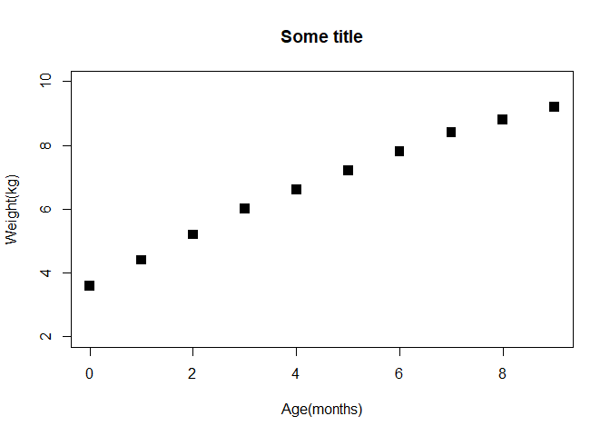

``` r
plot(weight,typ="b",pch=15,cex=1.5,lwd=2,ylim=c(2,10),xlab="Age(months)",ylab="Weight(kg)",main="Baby Weight with Age")
```

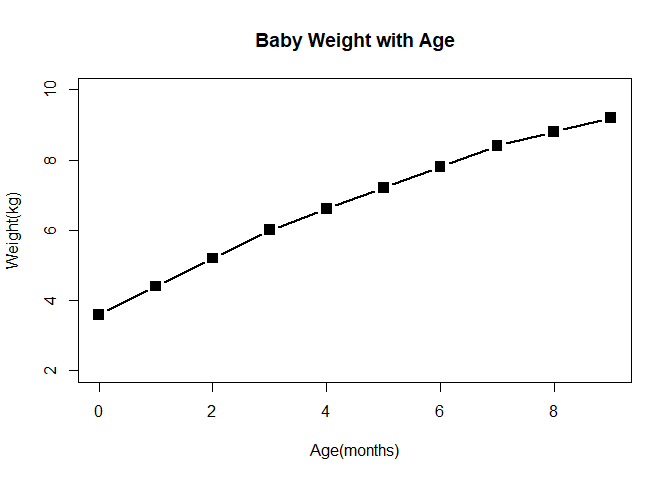

``` r
plot(weight,typ="o",pch=15,cex=1.5,lwd=2,ylim=c(2,10),xlab="Age(months)",ylab="Weight(kg)",main="Baby Weight with Age")
```

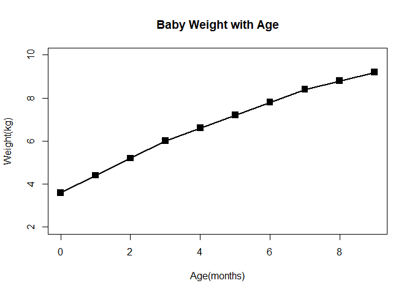

``` r
plot(weight,typ="o",pch=15,cex=2,lwd=3,ylim=c(2,10),xlab="Age(months)",ylab="Weight(kg)",main="Baby Weight with Age",col="green")
```

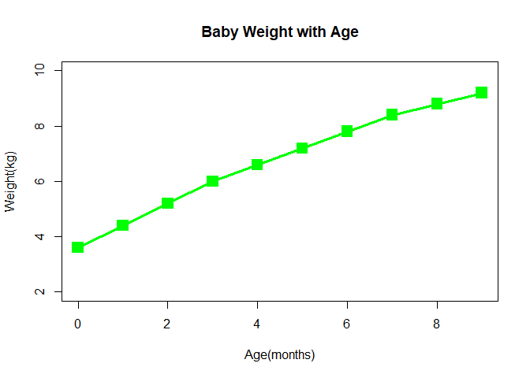

``` r
# Try a barplot
barplot(VADeaths,beside = TRUE)
```

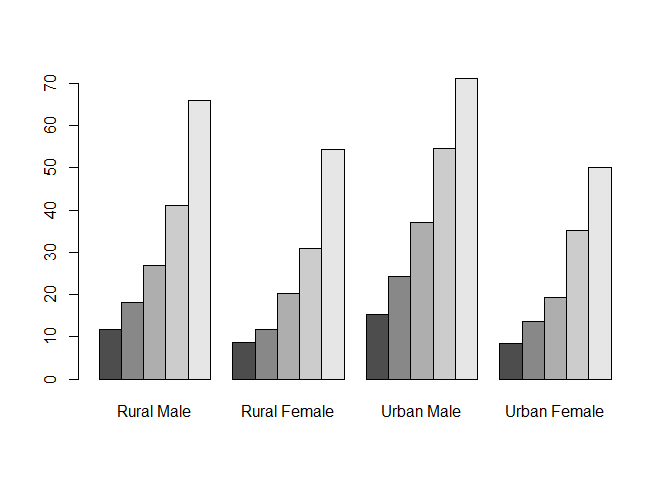

``` r
barplot(VADeaths,beside = FALSE)
```

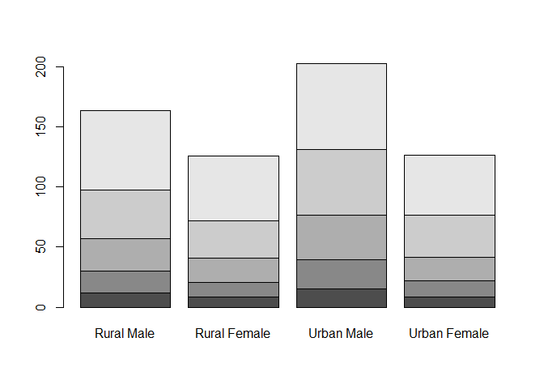

``` r
## Input our feature count data
mouse <- read.table("bimm143_05_rstats/feature_counts.txt", header = TRUE, sep = "\t")

barplot(mouse$Count,horiz = TRUE, names.arg = mouse$Feature, las=2)

#Change margin so we can see the labels
par(mar=c(3.1, 11.1, 4.1, 2))
barplot(mouse$Count,horiz = TRUE, names.arg = mouse$Feature, las=2)
```

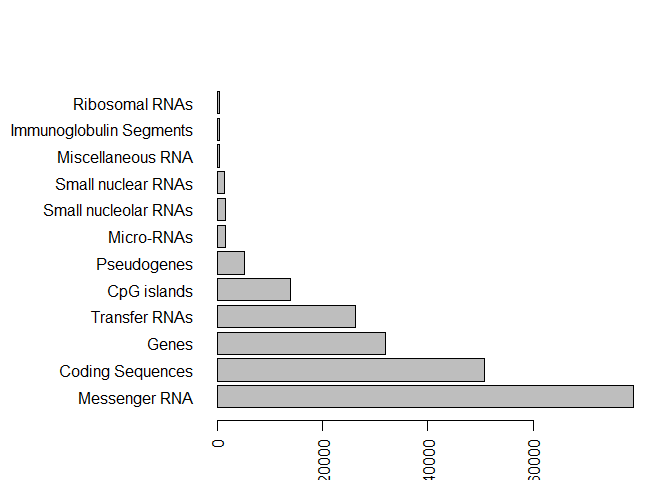

``` r
barplot(mouse$Count,horiz = TRUE, names.arg = mouse$Feature, las=1,col = cm.colors(11),ylab="",main = "Number of Features in the Mouse GRCm38 Genome",xlim = c(0,8000))
```

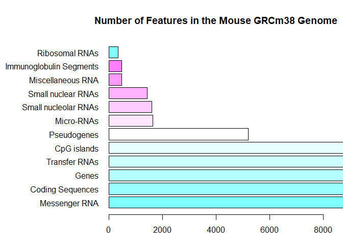

``` r
par(mar=c(5.1, 11.1, 4.1, 2.1))
barplot(mouse$Count,horiz = TRUE, names.arg = mouse$Feature, las=1,col = cm.colors(11),main = "Number of Features in the Mouse GRCm38 Genome",xlim = c(0,80000))
```

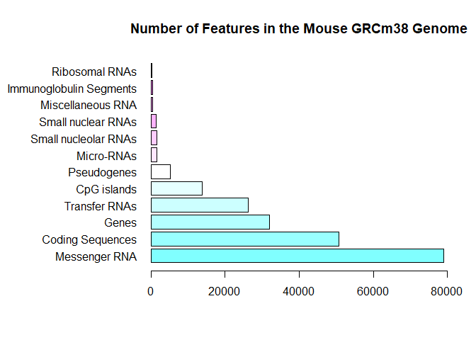

``` r
#Section 3:using color in plots
mf <- read.table("bimm143_05_rstats/male_female_counts.txt", sep = "\t", header = TRUE)
barplot(mf$Count, names.arg = mf$Sample, col = c("blue","pink"), las=2)
```

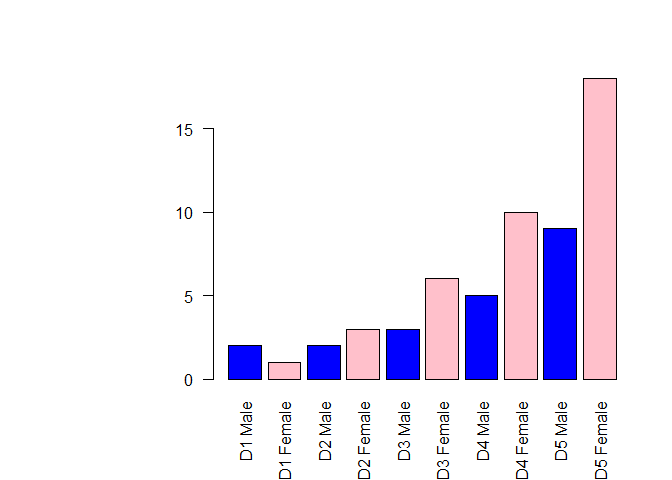

``` r
#coloring by value 
e <- read.table("bimm143_05_rstats/up_down_expression.txt", header = TRUE)

#how many genes
nrow(e)
```

    ## [1] 5196

``` r
#how many up, down, and all around
table(e$State)
```

    ## 
    ##       down unchanging         up 
    ##         72       4997        127

``` r
plot(e$Condition1,e$Condition2, col= e$State)
```

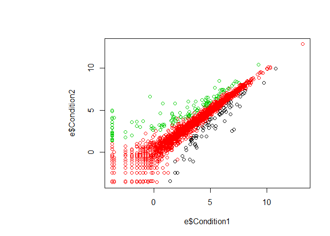

``` r
palette(c("purple","turquoise2","blue"))
plot(e$Condition1,e$Condition2, col= e$State)
```


``` r
sessionInfo()
```

    ## R version 3.5.2 (2018-12-20)
    ## Platform: x86_64-w64-mingw32/x64 (64-bit)
    ## Running under: Windows 10 x64 (build 17134)
    ## 
    ## Matrix products: default
    ## 
    ## locale:
    ## [1] LC_COLLATE=English_United States.1252 
    ## [2] LC_CTYPE=English_United States.1252   
    ## [3] LC_MONETARY=English_United States.1252
    ## [4] LC_NUMERIC=C                          
    ## [5] LC_TIME=English_United States.1252    
    ## 
    ## attached base packages:
    ## [1] stats     graphics  grDevices utils     datasets  methods   base     
    ## 
    ## loaded via a namespace (and not attached):
    ##  [1] compiler_3.5.2  magrittr_1.5    tools_3.5.2     htmltools_0.3.6
    ##  [5] yaml_2.2.0      Rcpp_1.0.0      stringi_1.2.4   rmarkdown_1.11 
    ##  [9] highr_0.7       knitr_1.21      stringr_1.3.1   xfun_0.4       
    ## [13] digest_0.6.18   evaluate_0.12
